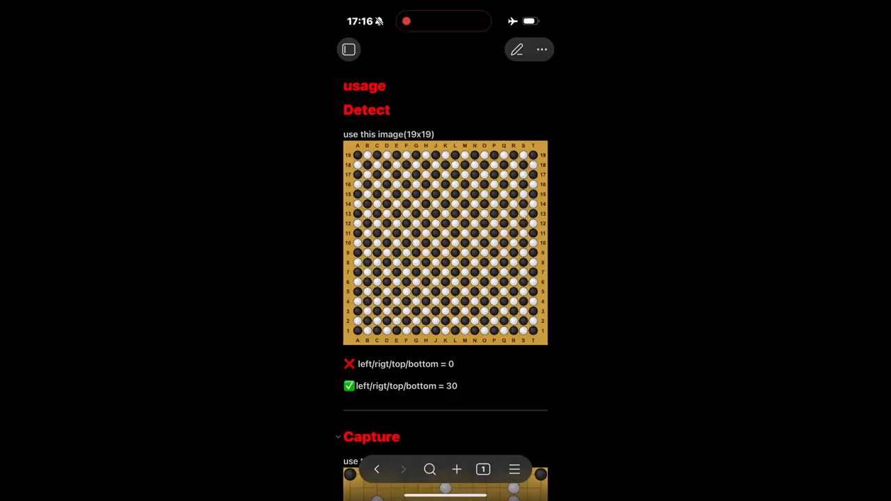

# GRBOARD — Obsidian Plugin

**GRBOARD (Go/Renju(Gomoku) BOARD)** is an Obsidian plugin that automatically detects stone positions from Go or Renju/Gomoku board images and converts them to SGF format. It also provides a full-featured SGF viewer that lets you view, edit, and play through games directly inside your notes.

-[日本語版はこちら](./README_ja.md)

---
## demo

[](docs/demo.mp4)

---

## Table of Contents

- [GRBOARD — Obsidian Plugin](#grboard--obsidian-plugin)
  - [demo](#demo)
  - [Table of Contents](#table-of-contents)
  - [Background](#background)
  - [Overview](#overview)
  - [Features](#features)
  - [Installation](#installation)
    - [Manual Installation](#manual-installation)
    - [Building from Source](#building-from-source)
  - [Board Detect View](#board-detect-view)
    - [Startup: Select a mode](#startup-select-a-mode)
    - [Step 1 — Load an image or generate a sample board](#step-1--load-an-image-or-generate-a-sample-board)
    - [Step 2 — Set the board size](#step-2--set-the-board-size)
    - [Step 3 — Crop the margins](#step-3--crop-the-margins)
    - [Step 4 — Adjust detection parameters](#step-4--adjust-detection-parameters)
    - [Step 5 — Run detection](#step-5--run-detection)
    - [Step 5.5 — Correct detection results](#step-55--correct-detection-results)
      - [Starting correction mode](#starting-correction-mode)
      - [Tapping an intersection to change its state](#tapping-an-intersection-to-change-its-state)
      - [How corrections are displayed](#how-corrections-are-displayed)
      - [Exiting correction mode](#exiting-correction-mode)
    - [Step 5.6 — Board graphic overlay on detection image](#step-56--board-graphic-overlay-on-detection-image)
      - [Starting the overlay](#starting-the-overlay)
      - [Adjusting opacity](#adjusting-opacity)
      - [Interaction with correction mode](#interaction-with-correction-mode)
    - [Step 6 — Board expand (optional)](#step-6--board-expand-optional)
    - [Step 7 — Export SGF](#step-7--export-sgf)
    - [Reset](#reset)
  - [SGF Viewer (grboard code block)](#sgf-viewer-grboard-code-block)
    - [View mode](#view-mode)
    - [Play mode](#play-mode)
    - [Edit mode](#edit-mode)
    - [Code block options](#code-block-options)
  - [SGF File View](#sgf-file-view)
  - [Embedding SGF in notes](#embedding-sgf-in-notes)
    - [What is displayed](#what-is-displayed)
    - [Basic usage](#basic-usage)
    - [Start from a specific move](#start-from-a-specific-move)
  - [Settings](#settings)
    - [Language](#language)
    - [Visual settings](#visual-settings)
  - [Supported games](#supported-games)
  - [Customizing the navigation button order](#customizing-the-navigation-button-order)
    - [Default order](#default-order)
    - [Customization example](#customization-example)
  - [License](#license)
- [Web App](#web-app)

---

## Background

After discovering [obsidian-goboard-viewer](https://github.com/j2masamitu/obsidian-goboard-viewer) and being impressed by the ability to interactively manipulate Go board positions in Obsidian, I wondered whether it could be applied to Renju as well. I wanted to reproduce puzzle positions from images so I could enjoy tsume-renju, and created this plugin using vibe coding, I believe the plugin achieves the functionality needed to enjoy tsume-renju. As far as board detection is concerned, there is no real difference between Go and Renju/Gomoku, and I hope players of both games can enjoy it.

Almost all of the board rendering and interaction logic is borrowed from the original plugin. Thank you for the wonderful work.

---

## Overview

GRBOARD addresses the need to automatically read board positions from game record images and convert them to SGF files that can be reviewed, edited, and replayed inside Obsidian. (Some images may not be detectable.)

Once a position has been imported as SGF, you can display an interactive board anywhere in your Vault simply by pasting a fenced code block.

---

## Features

| Category | Feature |
|---|---|
| **Detection** | Pure JavaScript Canvas-based stone detection — no native dependencies, mobile-friendly |
| **Detection** | Black stones: luminance analysis / White stones: ring contour score |
| **Detection** | Adjustable black threshold, white threshold, and ring score |
| **Detection** | Visual crop-margin overlay |
| **Detection** | Sample board generation for testing and calibration |
| **Detection** | Accuracy check by comparing results against a generated board |
| **Detection** | Manual correction of misdetected intersections by tapping in correction mode |
| **Detection** | Semi-transparent overlay of the board graphic onto the cropped detection image, with adjustable opacity |
| **SGF** | Export detection results as SGF (Go GM[1] or Renju/Gomoku GM[4]) |
| **SGF** | Board expand: place a partial board at a specified position on a larger output board |
| **SGF** | Copy to clipboard or save directly to the Vault |
| **Viewer** | Interactive SGF viewer rendered by Sabaki's Goban library |
| **Viewer** | Three modes: View / Play / Edit |
| **Viewer** | Navigation buttons: First / Prev / Next / Last |
| **Viewer** | Variation support with selection UI |
| **Viewer** | Move number display, last-move marker, SGF symbol markers (△ □ ○ ×) |
| **Viewer** | Auto-play with adjustable speed |
| **Viewer** | Inline embedding in notes via `![[file.sgf]]` |
| **Viewer** | Open `.sgf` files directly from the file explorer |
| **Viewer** | Export the current board position as a PNG (with optional markers and coordinate border) |
| **Edit** | Place and remove black and white stones |
| **Edit** | Add markers: triangle, square, circle, cross, text label |
| **Edit** | Edit per-node comments |
| **Edit** | Edit game info (player names, ranks, date, event, result, komi, etc.) |
| **Edit** | Delete all moves from the current position onward |
| **Edit** | Write changes back to the original `.md` or `.sgf` file |
| **Settings** | UI language: Japanese / English |
| **Settings** | Individual color customization for board background, detection markers, SGF markers, and move number labels |
| **Settings** | Adjustable detection marker size |

---

## Installation

### Manual Installation

1. Download the latest release from the [Releases page](https://github.com/natty291/obsidian-grboard/releases)
2. Extract the files to your Obsidian vault's `.obsidian/plugins/grboard/` directory
3. Enable the plugin under **Settings → Community Plugins**.
4. A **Board Detect** icon (scan symbol) will appear in the left sidebar ribbon.

### Building from Source

1. Clone this repository
2. Install dependencies: `npm install`
3. Build the plugin: `npm run build`
4. Copy the following files to `.obsidian/plugins/grboard/`:
   - `manifest.json`
   - `main.js`
   - `styles.css`
5. Enable the plugin under **Settings → Community Plugins**.
6. A **Board Detect** icon (scan symbol) will appear in the left sidebar ribbon.

---

## Board Detect View

Click the ribbon icon or run **"Open Board Detect view"** from the command palette to open the view.

---

### Startup: Select a mode

When the view opens, two options are presented.

| Button | Description |
|---|---|
| 📂 **Load image** | Open a board photo or diagram image from your device |
| 🖼 **New sample board** | Generate a sample board for testing and calibration |

---

### Step 1 — Load an image or generate a sample board

**Load image**
Click the button to open a file picker and select an image file (JPEG, PNG, etc.). You can also drag and drop an image onto the drop zone displayed in the main view.

**New sample board**
Clicking the button expands an options panel.

| Field | Description |
|---|---|
| Columns | Number of intersections horizontally (1–19) |
| Rows | Number of intersections vertically (1–19) |
| Stone count | Total number of stones to place randomly |

Click **▶ Generate & start** to draw the board. Stones are placed alternately at random, and the ground-truth data is stored internally so that detection accuracy can be verified afterward.

---

### Step 2 — Set the board size

In the **Board size** card, enter the number of columns and rows visible in the image. The detection engine uses these values to divide the image into a grid of intersections.

- Valid range: 1–19 for both columns and rows
- Non-square boards (e.g. 13 × 9) are supported

---

### Step 3 — Crop the margins

The **Margin crop** card lets you trim away the area outside the board (table edges, borders, background, etc.) on each of the four sides.

Each side (Top / Bottom / Left / Right) has a **slider and a numeric input** that stay in sync. Values are specified in pixels of the original image.

A **yellow dashed rectangle overlay** is shown in real time on the source image canvas to indicate the current crop region. A small **diagram** below the controls also shows the margin proportions visually.

The current image size in pixels is displayed at the top of the controls.

---

### Step 4 — Adjust detection parameters

The **Detection parameters** card contains three sliders.

| Parameter | Range | Default | Description |
|---|---|---|---|
| **Black threshold** | 30–150 | 80 | Pixels below this luminance value are considered "dark." An intersection whose average luminance falls below this value is classified as a black stone. |
| **White threshold** | 100–240 | 170 | Intersections with average luminance above this value are treated as white stone candidates. |
| **Ring score** | 5–90 % | 40 % | Minimum ratio of dark pixels detected on the circumference of a white stone candidate. If the ratio falls below this value, the intersection is classified as empty. |

> **Note: The black threshold also affects white stone detection.**
> When scanning the ring contour of a white stone candidate, the threshold for what counts as a "dark" pixel on the circumference is derived internally as black threshold × 1.8. This means that changing the black threshold affects not only black stone detection, but also the sensitivity of the white stone ring score. Raising the black threshold makes white stones easier to detect; lowering it makes them harder to detect.

**How detection works (summary)**

1. The image is cropped to the board region and resized.
2. For each intersection, the average luminance of a circular sampling area is computed.
3. Luminance < black threshold → **black stone**
4. Luminance > white threshold → ring contour scan is performed (dark pixel threshold = black threshold × 1.8). Ring score ≥ threshold → **white stone**, otherwise → **empty**
5. Otherwise → **empty**

The **Marker size** control (below the Detect button) adjusts the radius of the colored dots overlaid on the detection canvas, expressed as a percentage of one grid cell (5–100 %).

---

### Step 5 — Run detection

Click **▶ Detect** to run the detection pipeline.

- The cropped board image appears below the controls.
- Colored markers are overlaid at each intersection:
  - **Cyan / blue** — detected as a black stone
  - **Red / orange** — detected as a white stone
  - No marker — empty intersection
- The **Statistics** card shows the black stone count, white stone count, empty count, and total intersections.
- If a sample board was used, an **accuracy report** is displayed showing the number of correct intersections and a list of misdetections.

Once detection is complete, the **Board expand** card and **SGF output** card become available.

---

### Step 5.5 — Correct detection results

If any intersection was misdetected, you can fix it individually using the **✏ Correct** button.

#### Starting correction mode

Click the **✏ Correct** button (to the right of **▶ Detect**) to enter correction mode. The button turns orange and pulses, and the cursor changes to a crosshair over the cropped board image.

> Clicking the button again resets all corrections and restarts correction mode from scratch.

#### Tapping an intersection to change its state

While in correction mode, tapping an intersection cycles through states, starting from the next state after the auto-detected result.

| Auto-detected | 1st tap | 2nd tap | 3rd tap |
|---|---|---|---|
| Black stone | White stone | Empty | Clear (back to auto) |
| White stone | Empty | Black stone | Clear (back to auto) |
| Empty | Black stone | White stone | Clear (back to auto) |

#### How corrections are displayed

Corrected intersections are shown using the same marker style as auto-detection.

| Corrected state | Display |
|---|---|
| Black stone | Filled circle in the black marker color |
| White stone | Filled circle in the white marker color |
| Empty | Red ❌ |

#### Exiting correction mode

Click **✏ Correct** again, or re-run **▶ Detect**. Loading a new image also resets all corrections.

> **Note:** Corrections are reflected in SGF export and Board Expand results.

---

### Step 5.6 — Board graphic overlay on detection image

You can overlay the board graphic (illustrated stones) semi-transparently onto the cropped detection image (with detection markers). This lets you do a final visual check to confirm that the detected stone positions match the actual photograph.

#### Starting the overlay

Click the **🔍 Overlay image** button below the **✏ Correct** button. The board graphic is overlaid onto the cropped image at semi-transparency, and the button turns blue-purple. Click again to hide the overlay.

#### Adjusting opacity

The **slider** to the right of the button (10–90%, in steps of 5%) adjusts the transparency of the board graphic overlay. Changes take effect immediately.

- Lower value → the board graphic is more transparent, making the detection image easier to read
- Higher value → the board graphic is more opaque, making it easier to match stone positions against the photograph

#### Interaction with correction mode

When you change an intersection's state in correction mode, the overlay is automatically updated to reflect the latest state. This lets you confirm in real time that the stone positions on the board graphic align with those in the actual image.

> The overlay is automatically turned off when a new image is loaded or the view is reset.

---

### Step 6 — Board expand (optional)

The **Board expand** card converts a partial board (a corner diagram, side diagram, etc.) into a full board with the detected position placed at the correct location.

| Field | Description |
|---|---|
| **Output cols** | Number of columns in the full output board (1–19) |
| **Output rows** | Number of rows in the full output board (1–19) |
| **Offset X** | Column index where the left edge of the detected board is placed (0-based) |
| **Offset Y** | Row index where the top edge of the detected board is placed (0-based) |

Click **▶ Expand** to apply. The result is shown in the **Expand result** card as a summary and canvas, and subsequent SGF export will use this expanded board.

If you try to proceed to SGF export without running expand, you will be prompted to do so first (even if no offset is needed, please run expand with the same size).

---

### Step 7 — Export SGF

Once detection (and optional expansion) is complete, the **SGF output** card appears. Configure the following options.

| Field | Options | Description |
|---|---|---|
| **First move** | — / Black first / White first | Sets the `PL` property in the SGF root node |
| **Game mode** | Go / Renju · Gomoku | Sets `GM[1]` (Go) or `GM[4]` (Renju/Gomoku) |
| **Rules** | Free text | Sets the `RU` property (e.g. "Puzzle info"). Optional. |

Click **▶ Create SGF** to generate the SGF string. It appears in a read-only text area formatted as a ` ```grboard ` code block.

From there you can:

- **📋 Copy** — copy the code block (including the ` ```grboard ` fence) to the clipboard
- **💾 Save to Vault** — save the raw SGF (without the code block wrapper) as a timestamped `.sgf` file in the Vault root (e.g. `grb-20260620T143000.sgf`)

---

### Reset

Click the **Re-setup** button (red border) to show a confirmation dialog. On confirmation, all detection results, loaded images, and SGF output are cleared and the startup screen is shown.

---

## SGF Viewer (grboard code block)

Paste a `grboard` fenced code block anywhere in a note to embed an interactive board viewer.

````markdown
```grboard
(;GM[1]FF[4]SZ[19]PL[B]
AB[dd][pp][dp][pd]
AW[qq][pq]
;B[qd];W[dc];B[ce];W[ed])
```
````

The viewer is rendered below the mode selector dropdown. Use the dropdown to switch between **View / Play / Edit** modes.

If the SGF contains game info (player names, ranks, date, event, result, komi, rules), it is displayed above the board. If the `PL` property is set, a banner indicating the first player's color is also shown.

Click the 📷 **Save image** button in the top-right corner to export the current board position as a PNG file. A confirmation dialog appears with the following options.

| Option | Description |
|---|---|
| **Include markers** | Output last-move markers, SGF symbol markers, and move numbers in the PNG (default: ON) |
| **Include coordinates** | Add coordinate labels around the board (columns: A–T excluding I / rows: 1–N) (default: OFF) |

The saved filename uses a timestamp format (e.g. `grb-20260620T143000.png`).

---

### View mode

The default mode for reading and stepping through a game record.

**Navigation buttons**

| Button | Action |
|---|---|
| ⏮ First | Jump to the starting position (move 0) |
| ◀ Prev | Go back one move |
| Next ▶ | Go forward one move |
| ⏭ Last | Jump to the final move |

**Last-move marker**

A colored circle is shown on the most recently played stone (default: green).

**SGF markers**

Symbols defined in the SGF (`TR` triangle, `SQ` square, `CR` circle, `MA` cross, `LB` text label) are displayed on the board.

**Variations**

If there are branches at the current position, a **Select variation** panel appears with buttons labeled A, B, C… for each branch.

**Node comments**

If the current SGF node has a comment (`C` property), it is displayed in italics below the controls.

**Auto-play**

Auto-play controls appear below the navigation buttons (View mode only). Select a speed from the dropdown (0.5 s / 1 s / 2 s / 3 s per move) and press the play button to advance through the game automatically.

---

### Play mode

In Play mode you can click on the board to actually play moves.

- The current turn is shown as **● Black** or **○ White**.
- Clicking an intersection that already has a stone has no effect.
- Turns alternate automatically. The first player's color is determined by the SGF `PL` property; if not specified, Black goes first.
- Navigation buttons (⏮ ◀ ▶ ⏭) can be used to step through played moves.
- If you go back and play a new move, all subsequent moves are discarded.

**Show move numbers**

When the **Show move numbers** checkbox is on, each stone displays its move number. Captured stones are excluded. When off, only the last stone shows a circle marker.

The **📋 Copy** button generates an SGF string containing both the setup stones from the original SGF and all moves played in this session, and copies it to the clipboard.

> **Note:** Stone capture is only active in Go mode (`GM[1]`). It is disabled in Renju/Gomoku mode (`GM[4]`).

---

### Edit mode

In Edit mode you can directly edit the SGF content of the code block in the note.

**Click mode selector**

Use the dropdown to set what happens when you click an intersection.

| Mode | Action |
|---|---|
| **Move** | Play the next move (turns alternate; capture active in Go mode) |
| **Black Stone** | Place a black setup stone (`AB`) |
| **White Stone** | Place a white setup stone (`AW`) |
| **Triangle** | Add a triangle marker (`TR`) |
| **Square** | Add a square marker (`SQ`) |
| **Circle** | Add a circle marker (`CR`) |
| **Mark (X)** | Add a cross marker (`MA`) |
| **Label** | Add a text label (`LB`) — a text input appears; up to 3 characters |

Clicking an intersection that already has the same marker removes it (toggle behavior).

**Comment editing**

A text area displays and edits the comment (`C` property) for the current position. Click **💾 save comment** to apply.

**Game info editing**

A grid of input fields lets you edit all standard SGF game info properties.

- Black player name and rank (`PB`, `BR`)
- White player name and rank (`PW`, `WR`)
- Game name (`GN`), event (`EV`), round (`RO`)
- Date (`DT`), place (`PC`)
- Komi (`KM`), handicap (`HA`), result (`RE`), rules (`RU`)
- First player (`PL`)

Click **💾 save game info** to apply; the SGF output text area updates immediately.

The **🗑 delete from here** button deletes all moves from the current position onward. The move tree is rebuilt from the remaining nodes.

**Write back to file**

Click the **💾 Write to note** button (shown when the block has a source context) to overwrite the `grboard` code block in the original note file with the updated SGF. After saving, the view automatically scrolls to that block.

The SGF output text area (read-only) always reflects the current state of the SGF tree and can be copied manually at any time.

---

### Code block options

Options can be specified in the info string after ` ```grboard `.

```
```grboard bgcolor="#c8a84b"
```

| Option | Description |
|---|---|
| `bgcolor="#RRGGBB"` or `bgcolor="(r,g,b)"` | Background color applied only to this board. Overrides the "Board background color" setting. |

---

## SGF File View

Clicking a `.sgf` file in the file explorer opens it in the plugin's dedicated view, displaying an interactive board with a dropdown to switch between View, Play, and Edit modes.

---

## Embedding SGF in notes

Use Obsidian's standard embed syntax to inline a `.sgf` file from your Vault into a note.

```markdown
![[my-game.sgf]]
```

The plugin automatically detects the embed and replaces it with an interactive board viewer.

### What is displayed

Embeds are shown in **View mode only**. The following elements are displayed, as with a `grboard` code block.

| Element | Content |
|---|---|
| Board | Interactive board with coordinate labels |
| Last-move marker | Colored circle on the most recently played stone |
| SGF markers | Symbols defined in the SGF (△ □ ○ × text labels) |
| Game info | Player names, event, date, result, etc. from the SGF |
| Navigation | ⏮ First / ◀ Prev / Next ▶ / ⏭ Last |
| Move info | `Move: N / total` |
| Auto-play | ▶ auto play (adjustable speed) |

> **Note:** To prevent unintended edits to embedded SGF files, Edit mode, Play mode, the "Write to note" button, and the 📷 PNG export button are not available in embeds.

### Basic usage

```markdown
![[my-game.sgf]]
```

### Start from a specific move

Append `|move=N` to display move N as the initial position. Navigation buttons can then be used to move forward and backward from there.

```markdown
![[my-game.sgf|move=5]]
```

In the example above, move 5 is shown as the initial position, and pressing ⏮ First returns to move 0 (the initial setup).

---

## Settings

Open **Settings → Board Detect** to configure the plugin.

### Language

| Option | Description |
|---|---|
| English | Display the UI in English |
| 日本語 | Display the UI in Japanese |

Changing the language instantly updates the plugin view, settings screen, and command palette entries.

### Visual settings

All color pickers have a **Reset to default** button.

| Setting | Default | Description |
|---|---|---|
| **Board background color** | `#d4a843` (wood tone) | Background color for the detection result board and the SGF viewer |
| **Black stone marker color** | Cyan `rgba(0,200,255,0.8)` | Color of the dot overlaid on detected black stones |
| **White stone marker color** | Red `rgba(255,80,80,0.8)` | Color of the dot overlaid on detected white stones |
| **Last move marker color** | `#00aa00` (green) | Color of the circle shown on the most recently played stone |
| **Symbol marker color (on stone)** | `#ff0000` (red) | Color of SGF symbol markers (△ □ ○ ×) displayed on stones |
| **Symbol marker color (on empty)** | `#222222` (near black) | Color of SGF symbol markers displayed on empty intersections |
| **Move number color (on black stone)** | `#ffffff` (white) | Text color for move number labels on black stones |
| **Move number color (on white stone)** | `#000000` (black) | Text color for move number labels on white stones |

The **Marker size** control inside the Board Detect view adjusts the dot size of the detection overlay as a percentage of one grid cell (5–100 %). The value is automatically saved as a setting.

---

## Supported games

| Game | SGF GM value | Stone capture |
|---|---|---|
| Go | `GM[1]` | Yes |
| Renju / Gomoku | `GM[4]` | No |

Board sizes up to 19 × 19 are supported. Non-square boards are fully supported.

---

## Customizing the navigation button order

The display order of the SGF viewer navigation buttons (⏮ First / ◀ Prev / Next ▶ / ⏭ Last) can be changed using the CSS `order` property in `styles.css`.

### Default order
**⏮ ◀ ▶ ⏭**
```css
.grboard-btn-group .grboard-btn-first { order: 1; }
.grboard-btn-group .grboard-btn-prev  { order: 2; }
.grboard-btn-group .grboard-btn-next  { order: 3; }
.grboard-btn-group .grboard-btn-last  { order: 4; }
```

A lower `order` value places the button further to the left. Assign a distinct value to each of the four buttons to arrange them in any order.

### Customization example

**◀ ▶ ⏮ ⏭ — Prev / Next on the left**

```css
.grboard-btn-group .grboard-btn-first { order: 3; }
.grboard-btn-group .grboard-btn-prev  { order: 1; }
.grboard-btn-group .grboard-btn-next  { order: 2; }
.grboard-btn-group .grboard-btn-last  { order: 4; }
```

## License

MIT License - see [LICENSE](LICENSE) file for details

---

# Web App

For automatically detecting stones from images of Go, Renju, or Gomoku boards and converting them to SGF format, please use the Web App available [here](webapp)⁠.
